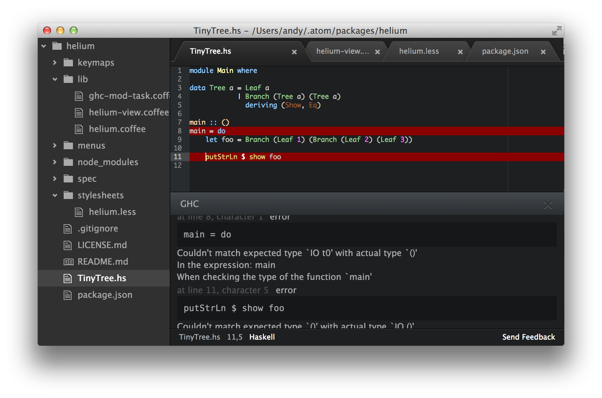

# Helium

Happy Haskell Hacking With [Atom](http://atom.io)

So far, about all this package does is to provide a 'check' command that
runs ghc against your code.  My eventual goal is to do this automatically in the
background, provide hotkeys for doing type lookups and navigating errors, and
to provide source-aware indexing of Haskell applications.

# Status

This project is like 4 hours in.  Don't hold your breath. :D
